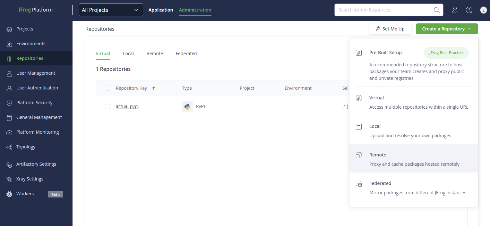
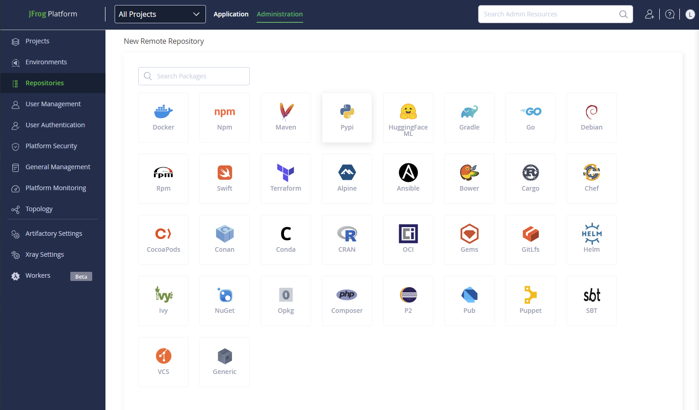
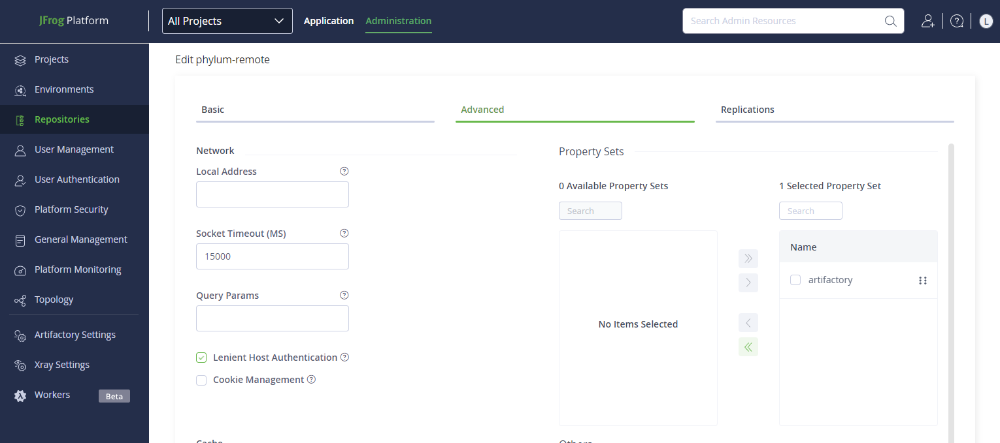
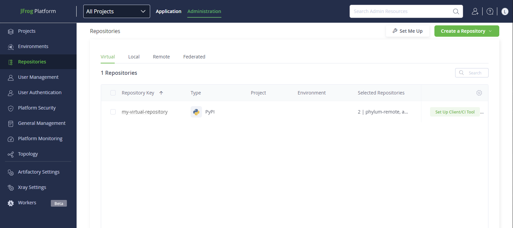
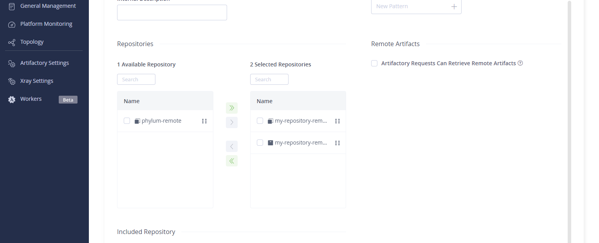
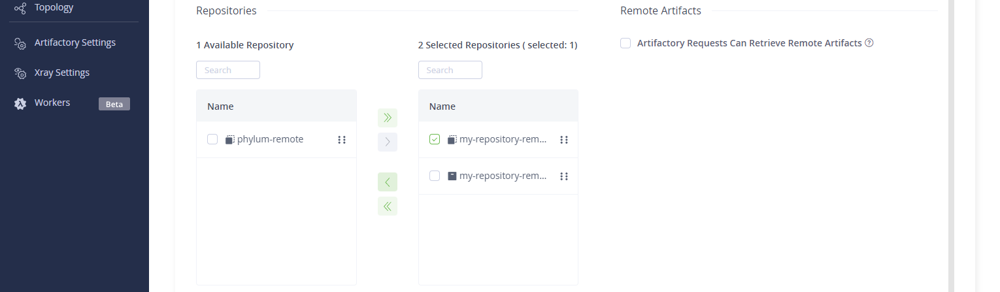
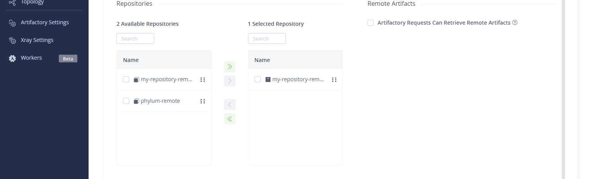
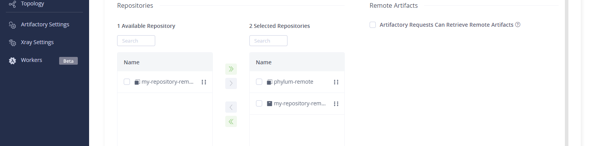
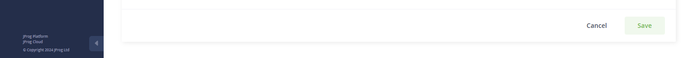

# Artifactory

Artifactory can handle both local and remote repositories. Local registries can
store and serve your internal packages; whereas, remote repositories will pull
packages from an external (sometimes third-party) source. PyPI in the Python
ecosystem would be an example of a remote repository in the context of your
Artifactory instance.

Phylum will serve as a remote repository, proxying requests to the actual package
registry (e.g., PyPI, npm, etc.) while ensuring that packages that enter your
organization’s Artifactory adhere to the policy you have defined regarding the
acceptable use of open source libraries/packages.

## Create a New Remote Repository

1. Create a remote repository for Phylum. Navigate to `Repositories > Administration`
   and click the green `Create a Repository` button in the top right and select `Remote`.

   

2. Select the appropriate package repository to which you would like to apply the
   policy. See current [Phylum supported ecosystems here](./about.md#supported-ecosystems).

   

3. Provide a name for your remote repository in the `Repository Key` field.
4. In the `User Name` field enter the name of the Phylum group where you
   previously defined your policy.
5. In the `Password/Access Token` field, enter a [Phylum API key](../knowledge_base/api-keys.md)
   with permission to access this group.
6. In the `URL` field, enter the [Phylum registry URL](./about.md#supported-ecosystems)
   for the ecosystem you are configuring.
7. Under the `Advanced` tab, click the checkbox next to `Lenient Host Authentication`.
   This will ensure that redirects (e.g., `HTTP 301`) are allowed and that requests
   to the repository succeed.

   

## Update Virtual Repository
Virtual repositories in Artifactory overlay all your local and remote repositories,
giving you a single host to use in your configuration. This makes the
decision-making process for pulling a package from your local or remote artifacts
opaque to the end user.

Once you have created a remote repository for Phylum, you should update your virtual
repository to use it.

1. Under `Repositories > Administration` locate your virtual repository. Click on
   the virtual repository you want to update.

   

2. In your virtual repository, scroll down to Repositories. You should see several
   repositories in the following format.

   

3. Under the `Selected Repositories` section, remove the existing remote by clicking
   the checkbox next to its name and clicking the green arrows pointing to the left.

   
   
   ---

   

4. Under the `Available Repositories` section, add your Phylum remote repository by
   clicking the checkbox next to its name and clicking the green arrows pointing to
   the right.

   

5. Save your settings using the green `Save` button at the bottom right of the screen.

   
 
