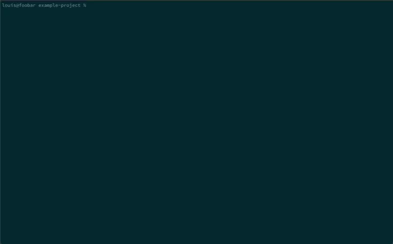

# Welcome! 👋

## The Phylum Platform automates software supply chain security to block new risks, prioritize existing issues and only use open-source code that you trust

---

Not a user yet? Get the free version [here](https://app.phylum.io/register).

[Quickstart](../cli/quickstart.md) -> (set up takes less than 10 minutes)

**OR** install our [GitHub App](https://github.com/marketplace/phylum-io) (a
free account is created automatically and set up takes 5 minutes)

---

Phylum provides a comprehensive, scalable approach to defending your software supply chain.
Get started with one or all of the below capabilities.

## Detect & Prevent

**Analyze risks and block threats from entering source code.**

### Analyze Your First Project

#### Download and Install the Phylum CLI

The Phylum CLI is available for a [variety of operating systems on
GitHub](https://github.com/phylum-dev/cli/releases/latest). However, you can
easily install the CLI with the following:

```sh
curl https://sh.phylum.io | sh
```


Once installed, authenticate your local development environment by running:

```sh
phylum auth login
```


#### Setup Your Phylum Project

All analysis jobs **must** be associated with a Phylum project. To setup your
project, run the following:

```sh
phylum init
```



#### Analyze your Project

To begin analyzing your project for software supply chain risks, submit your
dependency files to Phylum.

Resource: [Blog - Python lockfiles](https://blog.phylum.io/insights-and-resources/pick-a-python-lockfile-and-improve-security)

```sh
phylum analyze
```


#### (Optional) View Results in the Phylum UI

After submitting your project, view the results in the [web
UI](https://app.phylum.io).


## Defend Developers

### See results in less than 5 minutes

_Defend your developers and workstations from malicious code and prevent the
theft of SSH keys. Block suspect open-source containers automatically by
leveraging Phylum Bird Cage (Sandbox) and pre-install checks._


**Contained in the Phylum CLI:**
* Phylum allows you to defend your developers by running pre-install checks,
  shown in the video above
* Safely quarantine packages during install with [Phylum Sandbox
  (Birdcage)](https://github.com/phylum-dev/birdcage), which will restrict
  access to the filesystem, network, and environment variables
  * Put these tools into action by running: `phylum npm install`
