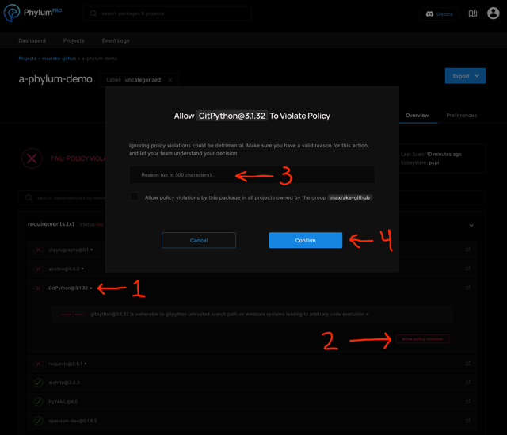
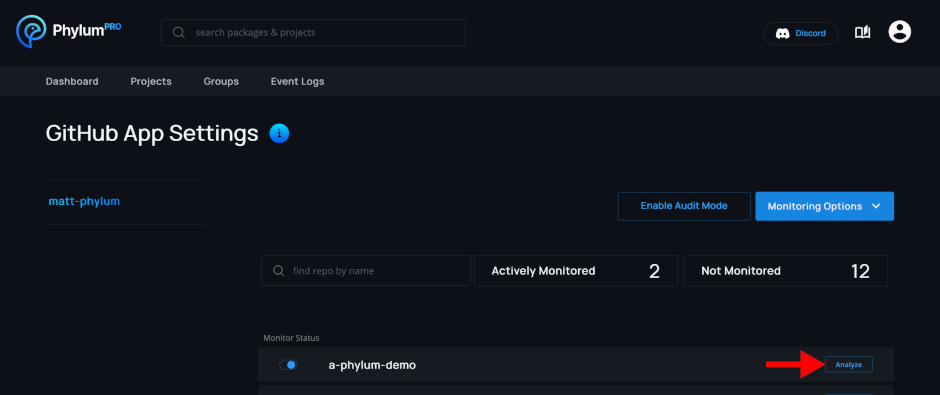
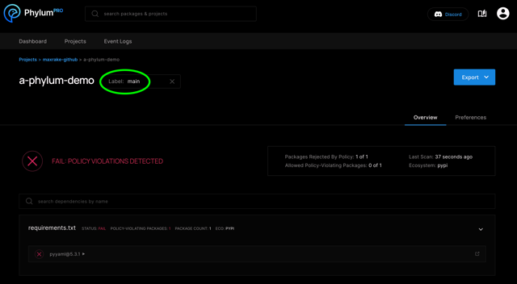

# GitHub App Integration

## Overview

Phylum provides a GitHub App to get your current and future repositories monitored quickly and easily. Follow along here or with the [Quickstart Guide within the Phylum UI](https://app.phylum.io/quickstart/github).

## Prerequisites

* Ability to install Apps in GitHub
* [Phylum account linked to GitHub](https://docs.phylum.io/docs/federate_account)
* Phylum Account set to Pro, if additional functionality is desired

## Installation Walkthrough

1. Go to the [Phylum App on the GitHub Marketplace](https://github.com/marketplace/phylum-io).
2. Click to install the free Phylum App. Be sure to select the intended account under the Account drop-down.

   

3. Fill in or edit account billing information.
4. Click the button to "Complete order and begin installation"
5. Choose **All** (default) or **Select** repositories and click to install. This setting controls which repositories _can be_ monitored by Phylum (i.e., visibility). Configuring repositories to be monitored [is a different step](#monitoring).

   

6. After installation, you will be redirected to the Phylum application to configure monitoring.
7. If you are a new user or are not logged in, select the GitHub button at the login screen.
   * This will automatically provision an account for new users.
8. Congratulations - the Phylum GitHub App is installed and ready to be configured to monitor your software supply chain!

## Usage

Once installed, the GitHub app can be managed through the settings menu available from the [Phylum UI](https://app.phylum.io). Click on your user icon and select the `GitHub App Settings` option from the dropdown menu:

### Monitoring

Monitoring can be activated or paused by selecting the toggle for a given repository. When first activated, a Phylum Project will be created and any supported lockfiles in the default branch will be analyzed.

> **NOTE:** [Phylum PRO accounts](https://www.phylum.io/pricing) can select to monitor all existing and future repositories!
>
> 

A monitored repository will automatically run a Phylum check for every commit to a Pull Request looking for changes to [supported lockfiles](https://docs.phylum.io/docs/supported_lockfiles). If a change is found, the lockfile is submitted for analysis:

A comment will be written to the PR if an issue is identified that fails the [defined policy](https://docs.phylum.io/docs/policy). There will be no comment if no dependencies were added or modified for a given PR. If one or more dependencies are still processing (no results available), then the comment will make that clear and the CI job will only fail if dependencies that have **completed analysis results** do not meet the active policy.

### Example Comments

---

Phylum OSS Supply Chain Risk Analysis - FAILED

---

Phylum OSS Supply Chain Risk Analysis - INCOMPLETE WITH FAILURE

---

Phylum OSS Supply Chain Risk Analysis - INCOMPLETE

---

Phylum OSS Supply Chain Risk Analysis - SUCCESS

---

### Groups

> **NOTE:** Only [Phylum PRO accounts](https://www.phylum.io/pricing) support groups.

The GitHub App will automatically create a group with the name of your GitHub account/organization. All Phylum projects created by the GitHub App will be owned by that group and results can be shared by adding Phylum PRO accounts as members to the group.

The default group that is created is owned by the account that installed the GitHub App. If you would like a different account to manage the GitHub App and group you may [transfer ownership](https://docs.phylum.io/docs/transfer_group_ownership) of the group.

### Policy

The Phylum GitHub app uses the [established project policy](https://docs.phylum.io/docs/policy) for making overall success/failure risk decisions. No configuration is required for setting the policy since a default policy is used for all projects. However, [Phylum PRO users](https://www.phylum.io/pricing) may specify custom policies for their projects to exercise fine-grained control over the risk decision logic.

### Remediation

There are several options to remediate failures determined by the GitHub app. A good first step is to click the link in the PR comment to "View this project in the Phylum UI":

That will provide results and details for individual package issues. Each issue can be reviewed and the entire package suppressed if all issues within it are found to be false positive, irrelevant, or otherwise acceptable to proceed:

Remaining issues may require lockfile modification to find alternative dependencies or otherwise remove the offending package.

After remediation steps are complete, the GitHub app can be re-triggered to run again by pushing new commits to the PR. If no code changes were made to the offending lockfile (issue suppression only), it is possible to manually trigger another run by first clicking the `Details` link for the `Phylum` status check on the PR:

That takes you to the `Checks` tab of the PR, where it is possible to re-run the failed analysis by either clicking the `Re-run` link for the `Phylum` status check specifically or the `Re-run failed checks` option from the `Re-run checks` dropdown menu to include it with all other failed checks.

### On-demand Analysis

It is possible to perform on-demand analysis of any repository for which the Phylum GitHub app has visibility. This includes all the repositories in the GitHub App Settings menu, whether or not they are actively monitored. The analysis will be of the current state of **the default branch** in the repository, for the [supported lockfiles](https://docs.phylum.io/docs/supported_lockfiles) that exist there.

To perform an on-demand analysis, click the `Analyze` button for the desired repository:

The results will be visible in the `Project` menu view for the selected project under the `Label` corresponding to the default branch:

## FAQ

### I activated monitoring, but it didn't run a scan. How do I get analysis results?

Check to ensure the repository contains a [supported lockfile](https://docs.phylum.io/docs/supported_lockfiles).

### Can I manage multiple GitHub App installations in Phylum?

Yes! If your account is linked to multiple GitHub App installtions, they will be displayed and selectable on the left side of the GitHub App Settings page in the Phylum UI.

### I want to monitor manifest files. Is that possible?

It is not currently possible to monitor and analyze dependency manifest files. The GitHub App is limited to lockfiles
only. If you still want to analyze manifest files, consider using the
[Phylum GitHub Actions Integration](https://docs.phylum.io/docs/github_actions) instead.
