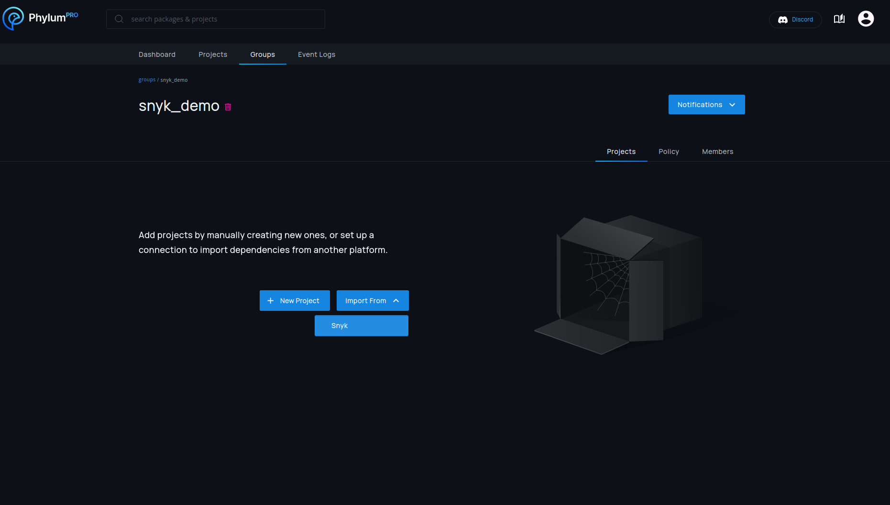
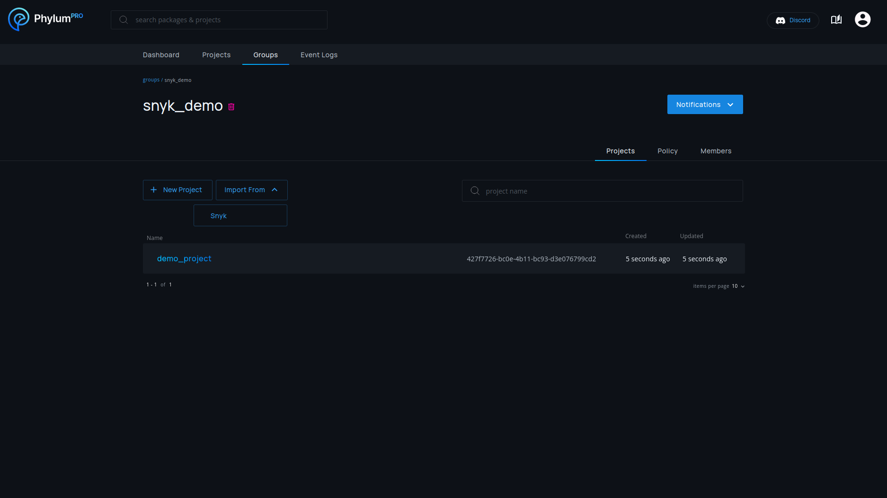
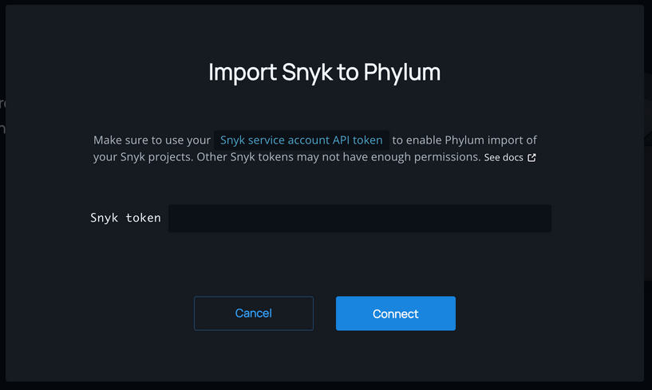
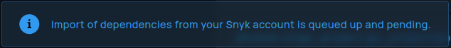
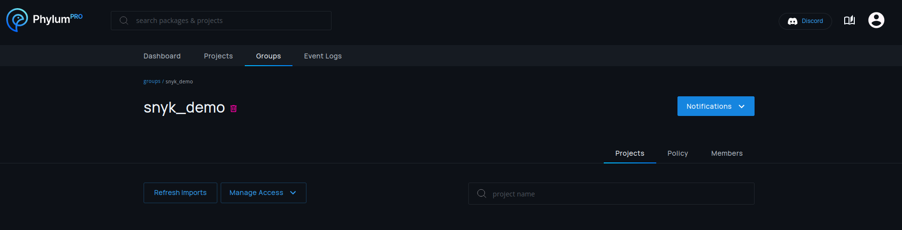
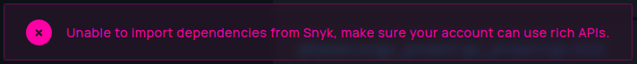
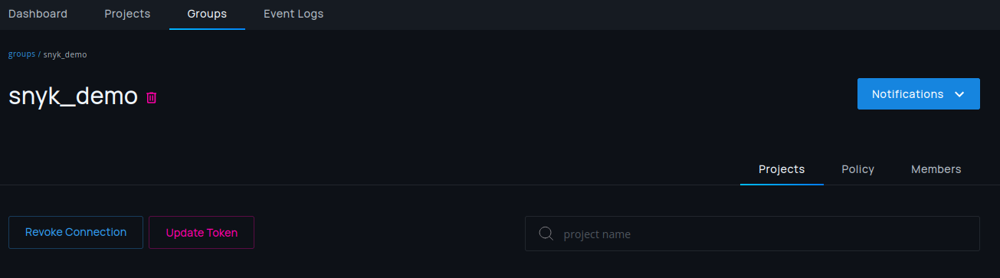
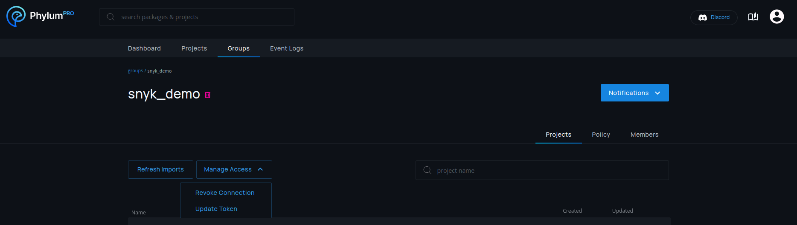

# Snyk Import

## Overview

Snyk provides information around third party software vulnerabilities. Phylum's
Snyk integration allows users of both products to automatically import Snyk
projects into Phylum and keep them up to date.

## Setup

Snyk connections are always associated with one specific group. In most cases it
makes sense to create a dedicated group for Snyk, but importing it into any
group is possible.

Setup for a new connection is done on the group page by selecting `Import From >
Snyk`.

To import projects from Snyk, Phylum needs a Snyk API key. This key is not only
used for authentication, but also decides which Snyk projects should be
imported. All projects accessible to the API key will be imported, so creating a
Snyk service account with the desired access permissions is recommended.

Instructions on setting up a service account can be found in Snyk's
documentation:

https://docs.snyk.io/enterprise-configuration/service-accounts#how-to-set-up-a-group-or-organization-service-account

## Updates

An import of all Snyk projects is automatically performed after initial setup.
Once setup, existing connections are re-imported once a day.

Imports run asynchronously, so it might take a while to finish and projects will
not necessarily all show up at the same time. Phylum will show a message if an
import is not completed yet.

Manual imports can be started at any time if the daily update is not sufficient.
This can be done by pressing the `Refresh Imports` button.

## Snyk Token Updates

Phylum will notify you if the associated token is revoked or invalidated.

In this case, the token can be updated by just pressing the red `Update Token`
button.

If the token is still valid, a manual change can be performed by selecting
`Manage Access > Update Token`.

## Deletion

Snyk connections can be deleted by selecting `Manage Access > Revoke Connection`
in any group with a Snyk connection. This will only stop future updates of the
connection and will not delete projects that are already imported.

