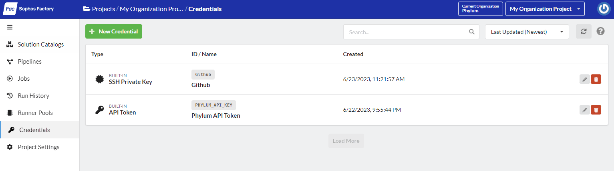
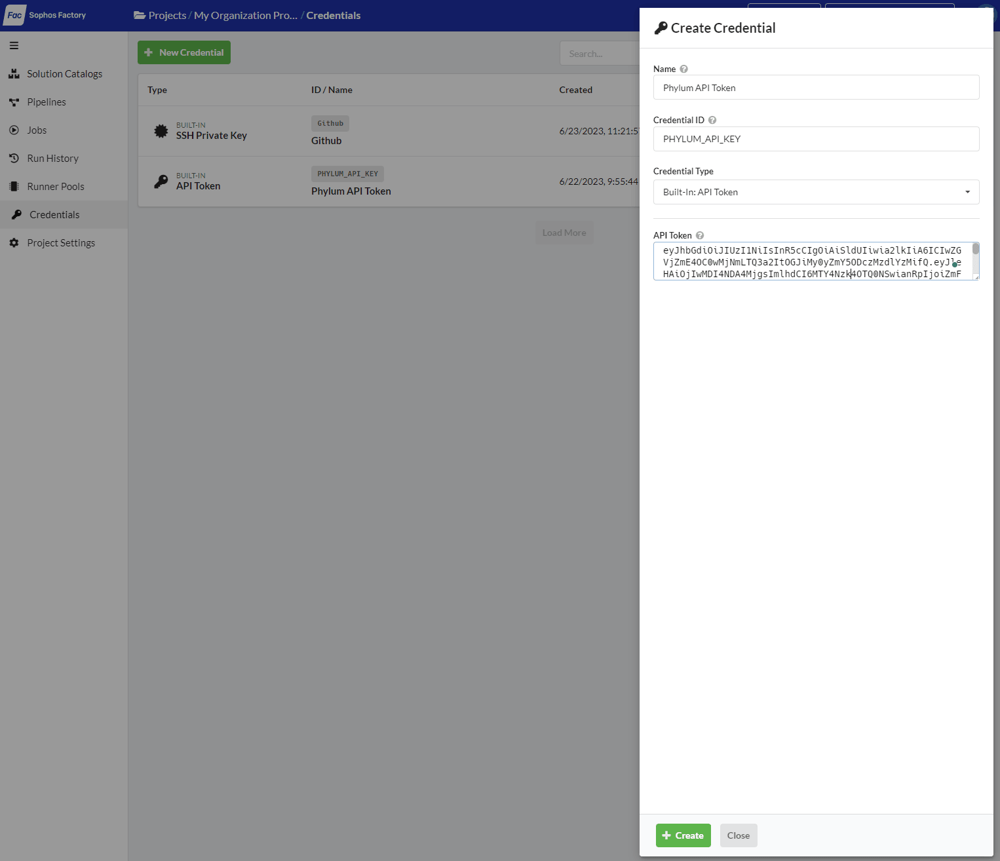
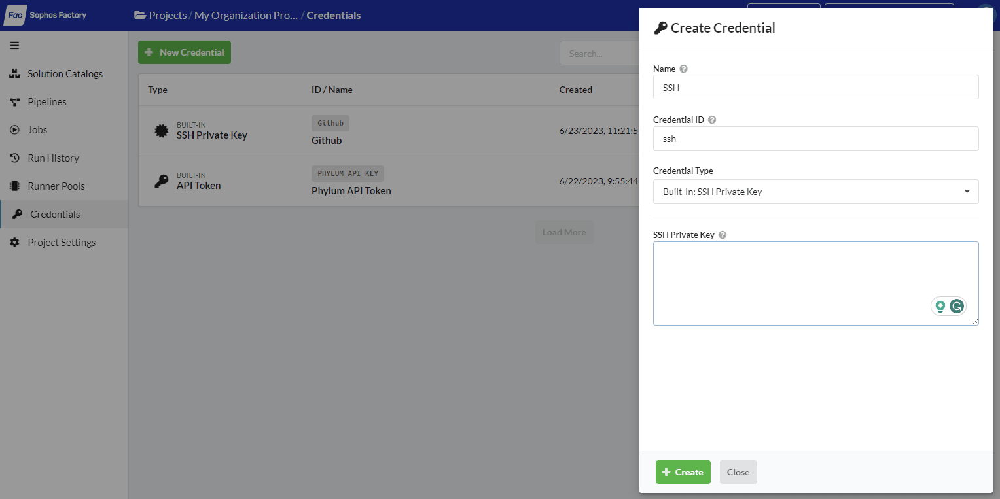
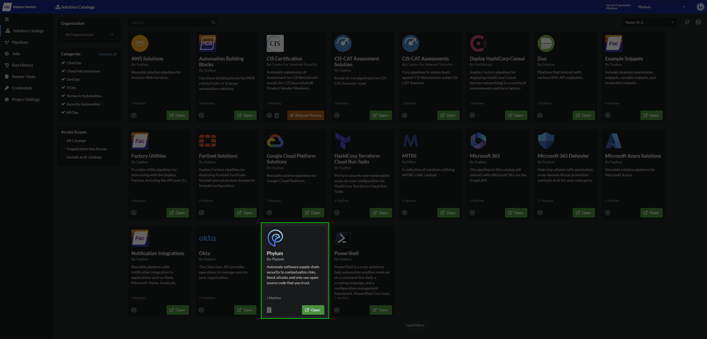
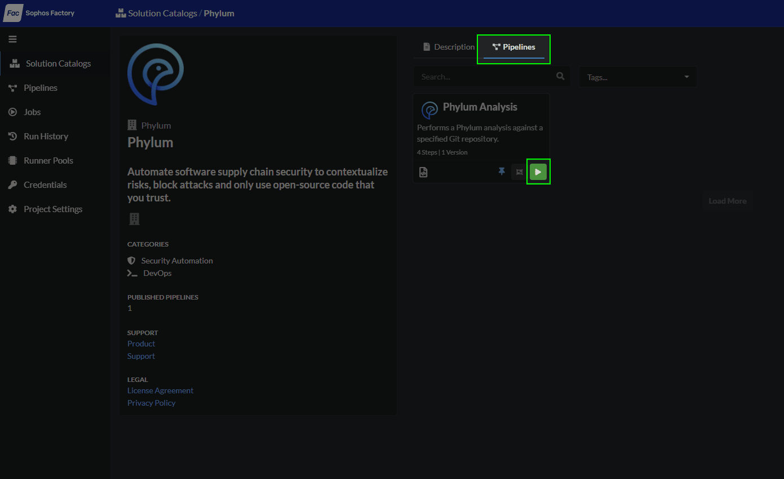

# Sophos Integration

## Overview

The Sophos Phylum integration allows users to check their dependencies in a specified Git repository using the [Phylum Platform](../home/welcome.md).

You will need:

1. A Phylum API token
2. (if required) An SSH key for accessing your Git repository
3. A Git repository containing a dependency file

## Setting Your Phylum API Token

An API token can be generated using the Phylum CLI. Run the following command:

```sh
phylum auth token
```

Copy the token in preparation for adding it to your Sophos Factory credentials. Additional information about Phylum API tokens can be found in [our documentation](../knowledge_base/api-keys.md).

### Add To Sophos Factory Credentials

After logging into Sophos Factory, click `Credentials` in the left-hand navigation, then click the green `+ New Credential` button:



A dialog will slide out from the right:



Fill out the form as follows:

| Field | Value |
| ----- | ----- |
| Name | Phylum API Token |
| Credential ID | PHYLUM_API_KEY |
| Credential Type | Built-In: API Token |
| API Token | (The API Token you copied above) |

Click the green `+ Create` button at the bottom of the dialog.

## Setting Your Git SSH Key

> ⚠️ Sophos Factory **only** accepts PEM-formatted RSA keys. Any other key formats (e.g., `ed25519`) will not work. To generate the correct key, use `ssh-keygen -t rsa -b 4096 -C "your_email@example.com" -m PEM`

You will need your SSH *private* key. This file is commonly found in `~/.ssh/id_rsa`. Copy this file and head back to Sophos Factory. Click `Credentials` in the left-hand navigation and click the green `+ New Credential` button:


A dialog will slide out from the right:



Fill out this form as follows:

| Field | Value |
| ----- | ----- |
| Name | SSH |
| Credential ID | ssh |
| Credential Type | Built-In: SSH Private Key |
| SSH Private Key | Your PEM formatted RSA Private Key |

Click the green `+ Create` button to save this credential.

## Locate the Pipeline and Initiate a Run

Visit the [solution catalog](https://app.refactr.it/catalogs) and locate the Phylum solution. Click the green `Open` button:



Under `Pipelines`, locate the `Phylum Analysis` pipeline and click on the green play button:



In the dialog that slides out, select your `phylumApiToken`, populate the `gitRepo`, and define the `branch` you want to analyze. Then click the green `Run` button to kick off the pipeline.
