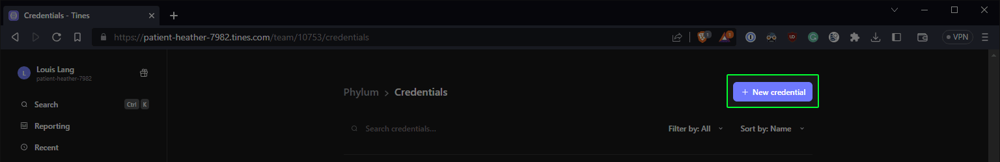
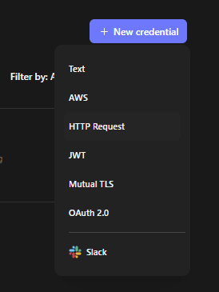
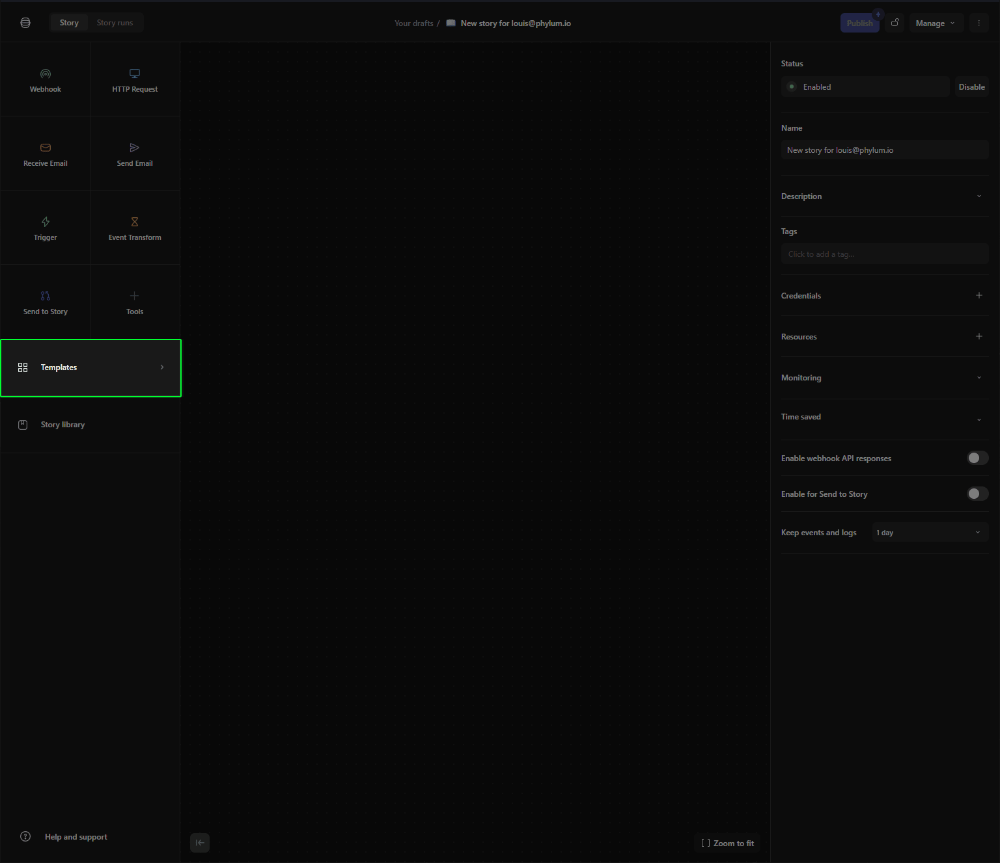
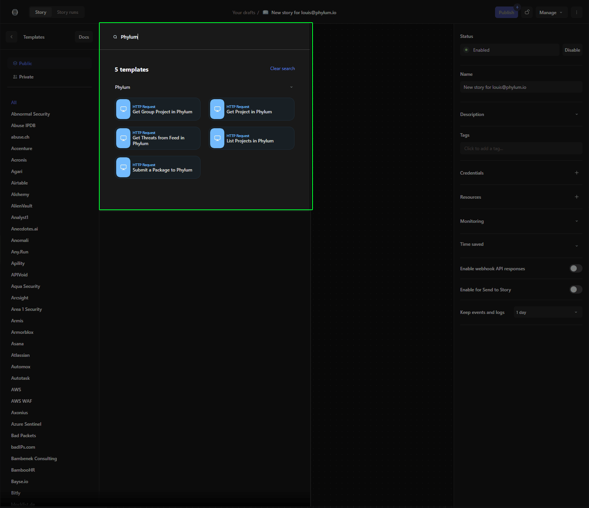
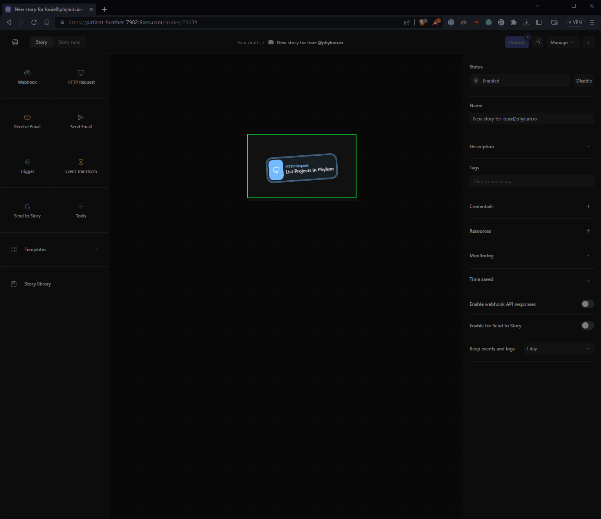

# Tines Integration

## Configuring Credentials

Tines has a concept of credentials that can be used from within stories. Under `Your Teams` on the left hand side, locate the `Credentials` item in the navigation and click it. On the new page, click on the `+ New credential` button in the top right:

and select `HTTP Request` in the drop down:

Name your new credential `Phylum` and populate the fields as follows:

| Field | Value |
| ----- | ----- |
| URL | `https://login.phylum.io/realms/phylum/protocol/openid-connect/token` |
| Content type | Form |
| Method | post |
| Builder | `{`  `"client_id": "phylum_cli",`  `"grant_type": "refresh_token",`  `"refresh_token": "<YourPhylumRefreshToken>"`  `}` |
| Headers | `Content-Type: application/x-www-form-urlencoded`  |
| Location of token from response | `REGEX_REPLACE( JSONPATH(phylum,"$.body.access_token"), "[\[\]\"]", "")` |
| Domains | `*.phylum.io` |

Click `Save` to finalize and save this credential. For any Phylum templates in Tines, be sure to select the appropriate `Phylum` credential.

## Selecting a Phylum Template

Tines is a no-code editor that allows users to work with and triage security-related data. Several Phylum capabilities are exposed in the Tines template catalog.

After signing into Tines and accessing your relevant story, locate the `Templates` section on the left of the editor:

In the dialog that pops up, enter `Phylum` to locate the Phylum templates:

Select the template you want to use in your story and drag and drop it over into the work area:

