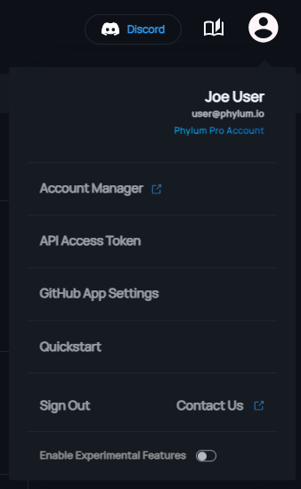

API keys provide you with the ability to authenticate with the Phylum API without requiring user credentials. API keys are well suited for CI/CD environments where you may not want to disclose your account information.

## Generate an API key

API keys can be generated in the [Phylum web UI][ui-tokens] by clicking on user menu in the top right and clicking on "API Access Tokens"

[ui-tokens]: https://app.staging.phylum.io/tokens/list



You will be prompted to provide a name for the new key and then will be given a chance to copy the newly generated API key.

**Important Note:** For security, there is no way to retrieve the value of a API key after initial generation. It is up to the user to securely store the key for later use.

## Using an API key

To use a token for authentication, include it as a bearer token on your API requests. For example:

```sh-session
> API_KEY=ph0_abcdefghijklmnopqrstuvwxyz0123456789ABCDEFG
> curl -H "Authorization: Bearer $API_KEY" 'https://api.staging.phylum.io/api/v0/groups'
{"groups":[]}
```

## API keys in the Phylum CLI

The CLI generates and stores an API key for its own use. This happens automatically upon first use, but it can also be prompted like so:

```sh
phylum auth login
```

The API key is stored in the `settings.yaml` file. The following command can be used to retrieve your token value:  

```sh
phylum auth token
```

If you are using the CLI in an environment where a `setting.yaml` file is not available (e.g., CI, scripts, etc.), you can provide an API key to CLI via the `PHYLUM_API_KEY` environment variable. If both the config file and environment variable are present, the key from the environment variable will be used.

## OpenID Connect vs API keys

Phylum APIs also support OAuth tokens via OpenID Connect. In fact, the Phylum CLI still supports using OAuth refresh tokens as the API key. However, these refresh tokens cannot be used directly against the Phylum APIs. Instead, the refresh token is used to get an access token from the OAuth provider and that access token is then used as the bearer token to make API requests.

If your CLI is using refresh tokens, you can get an access token for use in API requests using the following command:

```sh
phylum auth token --bearer
```

But that access token is only valid for about 6 minutes. If you find yourself regularly needing this, consider using [a CLI extension][extensions-rest-api] to make your API requests.

[extensions-rest-api]: https://docs.phylum.io/docs/extension_rest_api

If you don't want your CLI to use refresh tokens, update to the latest version and re-authenticate:

```sh
phylum auth login
```
