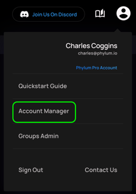
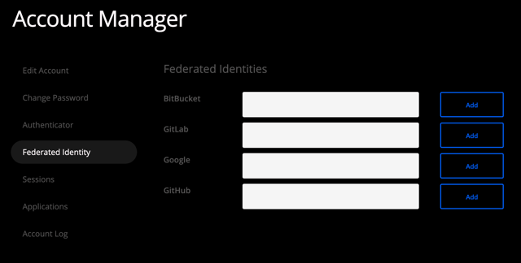
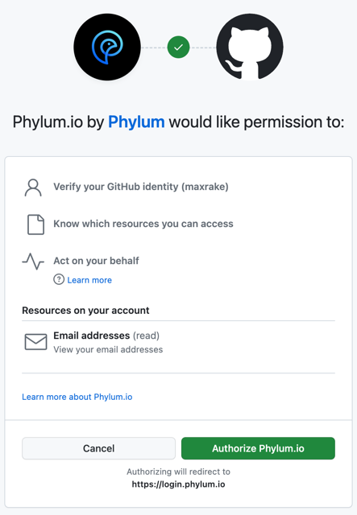
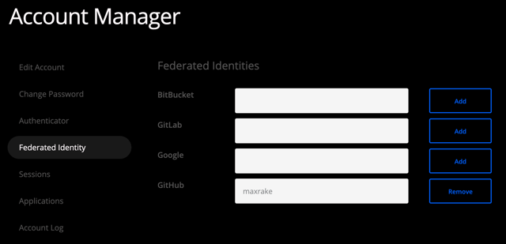

# Account Federation

Third party identity providers can be used to authenticate your Phylum account.

## Walkthrough

1. In the Phylum UI, click on your user icon and navigate to the `Account Manager` page.

    

2. Re-authenticate, if prompted.
3. Navigate to the `Federated Identity` sub-page.

    

4. Click Add/Remove button to link/unlink a third party identity.
5. Authenticate with the identity provider, if prompted.
6. Authorize the connection to Phylum. Example for GitHub:

    

7. Verify the connection shows in the `Federated Identities` menu. Example for GitHub (account name will be different):

    
