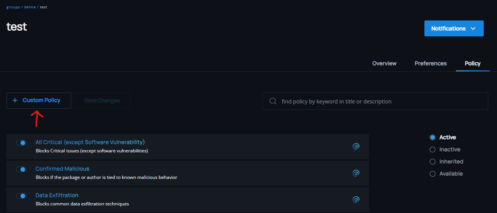
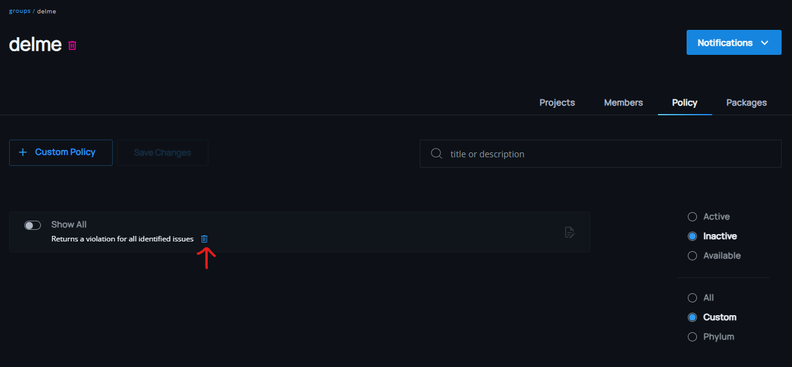

# Policy Management

## Add custom policy
Phylum allows group administrators to upload and apply custom policies. Whether added via the project or group view, these policies are stored at the group level and available to all projects in the group.
  

The Phylum UI uses the metadata at the top of the rego to display a `title` and `description` for the policy list, so this data is highly recommended.

## Remove custom policy
Removal of a custom policy requires the policy to be inactive on all projects. Removal is a destructive action and can only be performed by a group administrator. Phylum-provided policies cannot be removed from the available list. To remove a custom policy from the group, use the trash can icon on the policy tab of the group details view.

