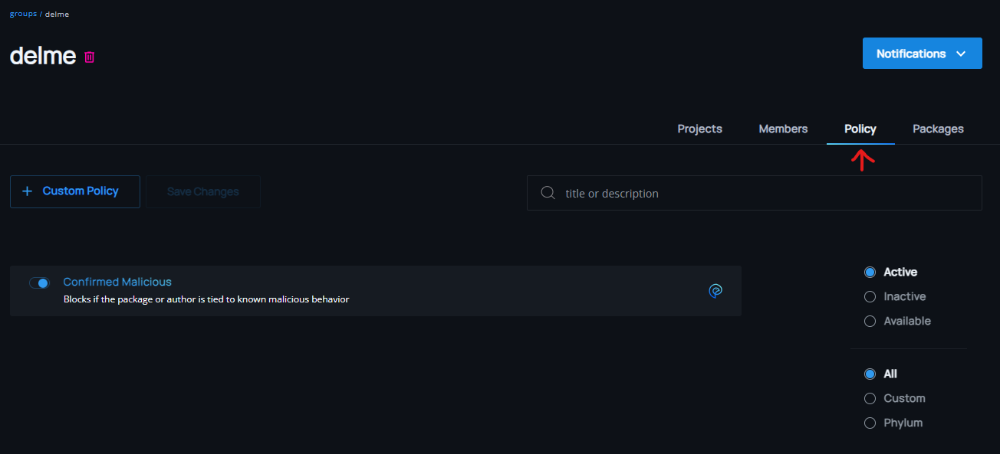
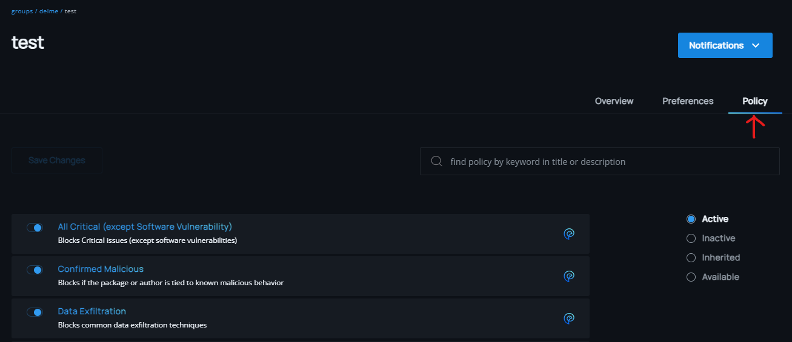

# Policy Usage
The Phylum policy framework allows you to overlay your threat model and block packages by surfacing issues for packages that violate the defined policy.

## Group Policy
Policies applied at the group level will be inherited by all projects belonging to the group. Only a group administrator can add, remove, enable, and disable group policies.

Group administrators may activate/deactivate group policies by selecting the `Policy` tab in the Group detail view. Use the toggles to activate or deactivate a policy from applying to all of the projects in that group.

## Project Policy
Project policies can be applied to individual projects (in addition to any inherited group policies). This allows you to further customize the resultant policy for a specific project. Note: Inherited group policies cannot be deactivated at the project level.

Group members may activate/deactivate project policies by selecting the `Policy` tab in the Project Details view. Use the toggles to activate or deactivate a policy from applying to that specific project.

